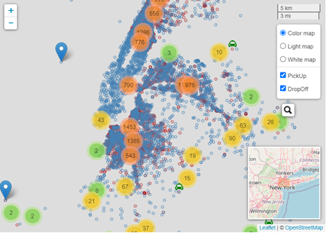

# NewYork-Taxi-Shiny-App-Interactive-maps

**Define the Problem**
   
 Visualize trip distance by time of day in any way you see fit, any observations?
 What are the most popular pickup locations on weekdays vs weekend?
 I want to know where I can most easily get a cab. Recommend a pick up spot where i can find a cab given my lat long.

**Data:**
   
 The scope of data is limited to Green taxi data for February 2016. There is also data dictionary available from the website, which explain the variable. The Data is available via NYC Trip Data.

**Interactive Maps:**
   
 It is very interesting to see that all the pick up location are outside of the core area of New York City. By doing a little research, I found out that the green taxi are only allowed to pick up passengers (street 
 hails or calls) in outer boroughs (excluding John F. Kennedy International Airport and LaGuardia Airport unless arranged in advance) and in Manhattan above East 96th and West 110th Streets. That explains the 
 pattern we see here:

