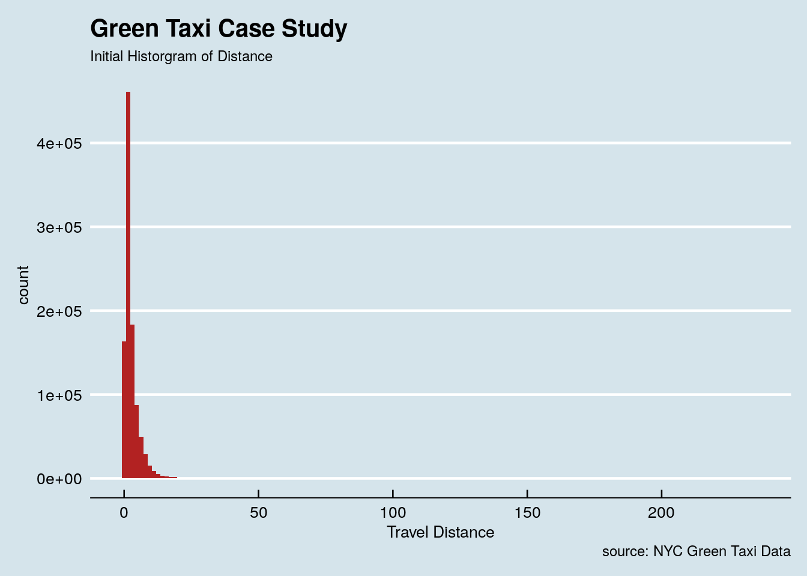
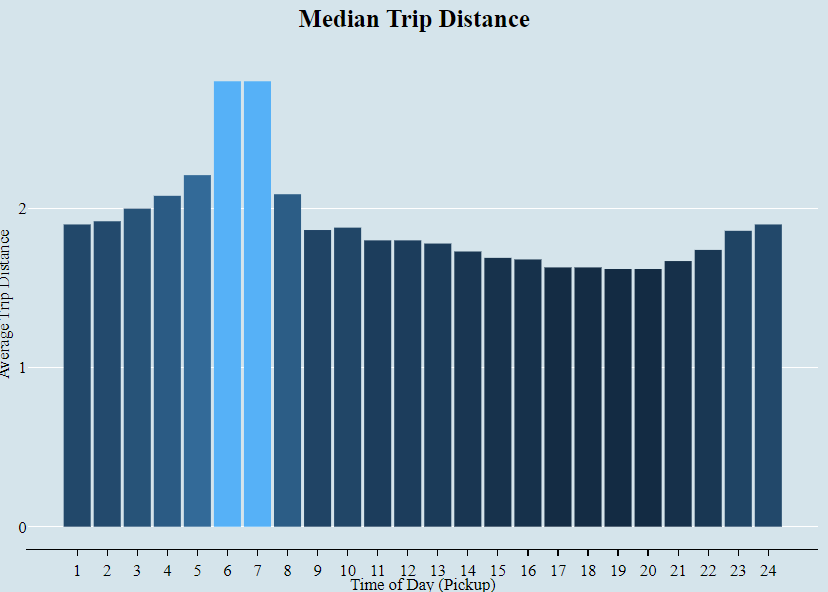
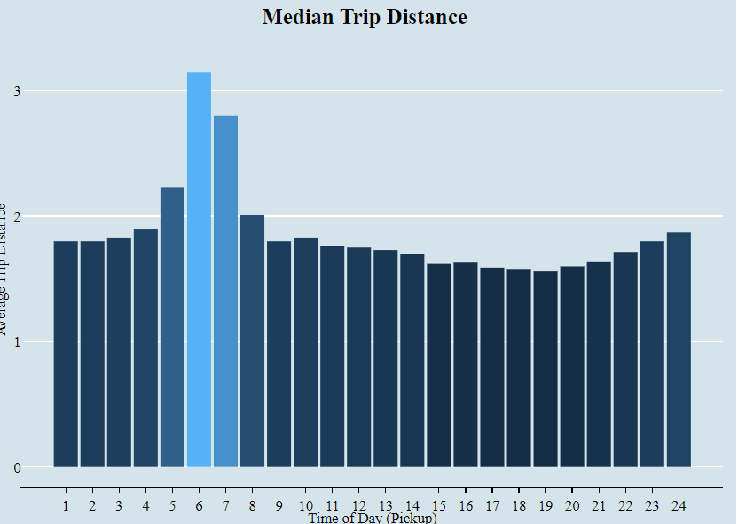
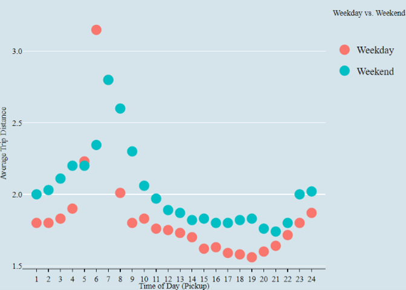
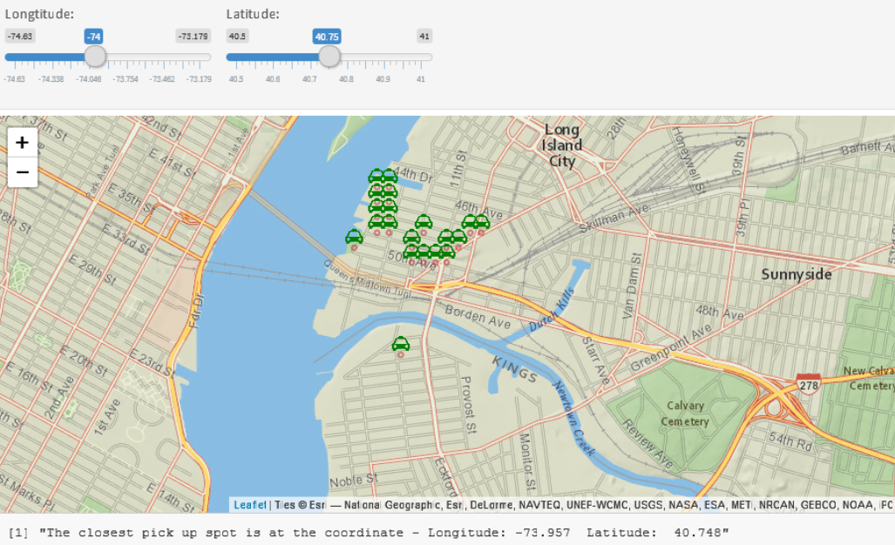

# NewYork-Taxi-Shiny-App-Interactive-maps

**Define the Problem**
   
 Visualize trip distance by time of day in any way you see fit, any observations?
 What are the most popular pickup locations on weekdays vs weekend?
 I want to know where I can most easily get a cab. Recommend a pick up spot where i can find a cab given my lat long.

**Data:**
   
 The scope of data is limited to Green taxi data for February 2016. There is also data dictionary available from the website, which explain the variable. The Data is available via NYC Trip Data.

**Interactive Maps:**
   
 It is very interesting to see that all the pick up location are outside of the core area of New York City. By doing a little research, I found out that the green taxi are only allowed to pick up passengers (street 
 hails or calls) in outer boroughs (excluding John F. Kennedy International Airport and LaGuardia Airport unless arranged in advance) and in Manhattan above East 96th and West 110th Streets. That explains the 
 pattern we see here:

 Interactive Map with Clustering
 

**The Distribution of Distance:**

The graph below, the data is skewed by the distance outliers.

**Trip Distance by Time of Day:**

Median Trip Distance by Time of Day for both Weekday and Weekend:

From an initial look at the trip distance by time of day graph, the median trip distance is longer at 6 AM and 7 AM than any other time during the day. The difference between the two hours and the rest of the day is quite significant.

Median Trip Distance by Time of Day for Weekday:

Same as the observation from the full dataset, 6 AM and 7 AM are still the two hour that people take taxi for the longest median trip distance. However, in this case, the median trip distance is slightly longer at 6 AM. At that day of the weekday, my assumption is most of the taxi usage is caused by the commute to go to work. Since people usually start work at 8 AM, one of the potential explanation is that people who live further from their work place tend to leave a bit earlier than the people who live close by. Moreover, it might also cause by that more people take taxi to work at 6 AM compared to 7 AM. Therefore, the median trip distance is slightly longer at 6 AM than 7 AM.

**Combined Weekday and Weekend Median Trip Distance**

**Shiny App:**

